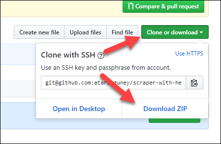

# What?

This script is to scrape Amazon Deals page. Read the following instructions to see how to use it.

# How to use it?

1. Download NodeJS first from the following link: https://nodejs.org/en/download/ for your operating system. (e.g, choose Mac if you are using Mac)
1. Make sure that you have the latest Google Chrome installed. At the time this script was developed, the latest version of Google Chrome was 61. So use something newer or equal to 61.
1. Download by clicking the button shown below:

   

1. Unzip the downloaded file.
1. Change your directory to wherever you unzipped it using your terminal.
1. Run `npm install` in your current directory. This will download the necessary dependency packages that you need to be able to execute the next step.
1. Run `node main.js` command on your terminal while you are in the same directory.
1. Once the script is done executing, you will see a new file created named `result.js`, and just open it using a text editor. You will see a result in JSON format. Use it however you like.

You can use various tools to parse JSON format and consume it within them however you like. It is a very versatile format and can be presented in various shapes and forms using existing tools. For instance, a primitive tool that just formats JSON text into a more readable format is http://jsonviewer.stack.hu/

## Notes

After you install NodeJS, please restart your terminal if it is open.